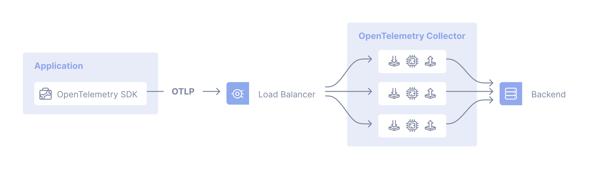
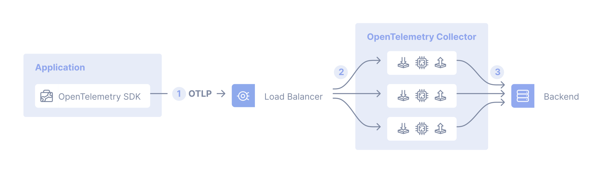
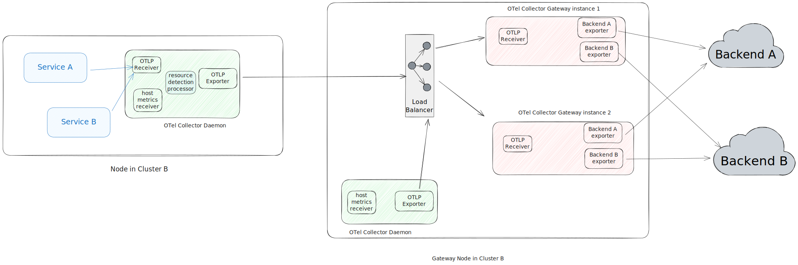

コレクターのゲートウェイデプロイメントパターンは、アプリケーション（または他のコレクター）がテレメトリーシグナルを単一のOTLPエンドポイントに送信し、そのエンドポイントが実行されている1つ以上のコレクターインスタンスによって処理される構成です。
このコレクターインスタンスは、通常、クラスターごと、データセンターごと、またはリージョンごとに単独のサービス（たとえばKubernetesのデプロイメント）として実行されます。

一般的なケースでは、アウトオブボックスのロードバランサーを使用して、コレクター間で負荷を分散できます。



テレメトリーデータの処理が特定のコレクターで行われる必要があるユースケースでは、2層の設定を使用します。
1層目のコレクターは、[Trace ID/サービス名を意識したロードバランシングエクスポーター][lb-exporter]を使用して設定され、2層目ではスケールアウトを処理するコレクターが使用されます。
たとえば、[テイルサンプリングプロセッサー][tailsample-processor]を使用する場合、すべてのスパンが同じコレクターインスタンスに到達し、そこでそのサンプリングポリシーが適用されるように、ロードバランシングエクスポーターを使用する必要があります。 For example, you will need to use the
load-balancing exporter when using the [Tail Sampling
processor][tailsample-processor] so that all spans for a given trace reach the
same collector instance where the tail sampling policy is applied.

Let's have a look at such a case where we are using the load-balancing exporter:



1. アプリケーションで、SDKがOTLPデータを中央の場所に送信するように設定されます。
2. ロードバランシングエクスポーターを使用して設定されたコレクターが、シグナルを複数のコレクターに分散します。
3. コレクターはテレメトリーデータを1つ以上のバックエンドに送信するように設定されます。

## 例 {#examples}

### NGINXを「アウトオブボックス」のロードバランサーとして使用 {#nginx-as-an-out-of-the-box-load-balancer}

2つのコレクター（`collector1`と`collector2`）が設定され、NGINXを使用してその間でトラフィックをロードバランシングしたい場合、次の設定を使用できます。

```nginx
server {
    listen 4317 http2;
    server_name _;

    location / {
            grpc_pass      grpc://collector4317;
            grpc_next_upstream     error timeout invalid_header http_500;
            grpc_connect_timeout   2;
            grpc_set_header        Host            $host;
            grpc_set_header        X-Real-IP       $remote_addr;
            grpc_set_header        X-Forwarded-For $proxy_add_x_forwarded_for;
    }
}

server {
    listen 4318;
    server_name _;

    location / {
            proxy_pass      http://collector4318;
            proxy_redirect  off;
            proxy_next_upstream     error timeout invalid_header http_500;
            proxy_connect_timeout   2;
            proxy_set_header        Host            $host;
            proxy_set_header        X-Real-IP       $remote_addr;
            proxy_set_header        X-Forwarded-For $proxy_add_x_forwarded_for;
    }
}

upstream collector4317 {
    server collector1:4317;
    server collector2:4317;
}

upstream collector4318 {
    server collector1:4318;
    server collector2:4318;
}
```

### ロードバランシングエクスポーター {#load-balancing-exporter}

For a concrete example of the centralized collector deployment pattern we first
need to have a closer look at the load-balancing exporter. It has two main
configuration fields:

- The `resolver`, which determines where to find the downstream collectors (or:
  backends). If you use the `static` sub-key here, you will have to manually
  enumerate the collector URLs. The other supported resolver is the DNS resolver
  which will periodically check for updates and resolve IP addresses. For this
  resolver type, the `hostname` sub-key specifies the hostname to query in order
  to obtain the list of IP addresses.
- `routing_key`フィールドを使用するとロードバランシングエクスポーターがスパンを特定の下流のコレクターにルーティングするように指示します。
  このフィールドを`traceID`（デフォルト）に設定すると、ロードバランシングエクスポーターは`traceID`に基づいてスパンをエクスポートします。
  その他の場合、`routing_key`に`service`を設定すると、サービス名に基づいてスパンをエクスポートします。
  これは、[スパンメトリクスコネクター][spanmetrics-connector]のようなコネクターを使用する際に有用で、サービスのすべてのスパンが同じ下流のコレクターに送信され、メトリクス収集が行われ、正確な集約が保証されます。 If you set this field to `traceID`
  (default) then the Load-balancing exporter exports spans based on their
  `traceID`. Otherwise, if you use `service` as the value for `routing_key`, it
  exports spans based on their service name which is useful when using
  connectors like the [Span Metrics connector][spanmetrics-connector], so all
  spans of a service will be send to the same downstream collector for metric
  collection, guaranteeing accurate aggregations.

OTLPエンドポイントを提供する最初の層のコレクターは次のように設定されます。

 {}

```yaml
receivers:
  otlp:
    protocols:
      grpc:
        endpoint: 0.0.0.0:4317

exporters:
  loadbalancing:
    protocol:
      otlp:
        tls:
          insecure: true
    resolver:
      static:
        hostnames:
          - collector-1.example.com:4317
          - collector-2.example.com:5317
          - collector-3.example.com

service:
  pipelines:
    traces:
      receivers: [otlp]
      exporters: [loadbalancing]
```

{} {}

```yaml
receivers:
  otlp:
    protocols:
      grpc:
        endpoint: 0.0.0.0:4317

exporters:
  loadbalancing:
    protocol:
      otlp:
        tls:
          insecure: true
    resolver:
      dns:
        hostname: collectors.example.com

service:
  pipelines:
    traces:
      receivers: [otlp]
      exporters: [loadbalancing]
```

{} {}

```yaml
receivers:
  otlp:
    protocols:
      grpc:
        endpoint: 0.0.0.0:4317

exporters:
  loadbalancing:
    routing_key: service
    protocol:
      otlp:
        tls:
          insecure: true
    resolver:
      dns:
        hostname: collectors.example.com
        port: 5317

service:
  pipelines:
    traces:
      receivers: [otlp]
      exporters: [loadbalancing]
```

{} 

ロードバランシングエクスポーターは、`otelcol_loadbalancer_num_backends`や`otelcol_loadbalancer_backend_latency`などのメトリクスを出力し、これらを使用してOTLPエンドポイントコレクターのヘルスとパフォーマンスを監視できます。

## エージェントとゲートウェイのコレクターの組み合わせたデプロイメント {#combined-deployment-of-collectors-as-agents-and-gateways}

複数のOpenTelemetryコレクターをデプロイする場合、エージェントとしてもゲートウェイとしてもコレクターを実行することがよくあります。

以下の図は、このような組み合わせたデプロイメントのアーキテクチャを示しています。

- エージェントデプロイメントパターンで実行されるコレクター（各ホストで実行され、Kubernetesデーモンセットのように）を使用して、ホスト上で実行されるサービスからのテレメトリーとホストのテレメトリー（ホストメトリクスやスクラップログなど）を収集します。
- ゲートウェイデプロイメントパターンで実行されるコレクターを使用して、データの処理（たとえばフィルタリング、サンプリング、バックエンドへのエクスポートなど）を行います。



この組み合わせたデプロイメントパターンは、コレクター内でホストごとにユニークである必要があるコンポーネントや、アプリケーションが実行されている同じホストにしか利用できない情報を消費するコンポーネントを使用する場合に必要です。

- [`hostmetricsreceiver`](https://github.com/open-telemetry/opentelemetry-collector-contrib/tree/main/receiver/hostmetricsreceiver)や[`filelogreceiver`](https://github.com/open-telemetry/opentelemetry-collector-contrib/tree/main/receiver/filelogreceiver)のようなレシーバーは、ホストインスタンスごとにユニークである必要があります。
  これらのレシーバーを複数実行すると、データが重複します。 Running multiple instances of these
  receivers will result in duplicated data.

- [`resourcedetectionprocessor`](https://github.com/open-telemetry/opentelemetry-collector-contrib/tree/main/processor/resourcedetectionprocessor)のようなプロセッサーは、ホスト、コレクター、アプリケーションの情報を追加するために使用されます。
  リモートマシン上のコレクター内でこれらを実行すると、不正確なデータが生成されます。 Running them within a Collector on a remote machine will
  result in incorrect data.

## トレードオフ {#tradeoffs}

短所：

- 中央で管理された認証情報などの関心事を分離できる
- 中央集権型でポリシー（たとえば、特定のログのフィルタリングやサンプリング）を管理できる

Cons:

- It's one more thing to maintain and that can fail (complexity)
- カスケードされたコレクターの場合のレイテンシーの増加
- 全体的なリソース使用量の増加（コスト）

[lb-exporter]: https://github.com/open-telemetry/opentelemetry-collector-contrib/tree/main/exporter/loadbalancingexporter
[tailsample-processor]: https://github.com/open-telemetry/opentelemetry-collector-contrib/tree/main/processor/tailsamplingprocessor
[spanmetrics-connector]: https://github.com/open-telemetry/opentelemetry-collector-contrib/tree/main/connector/spanmetricsconnector

## 複数のコレクターとシングルライター原則 {#multiple-collectors-and-the-single-writer-principle}

OTLP内のすべてのメトリクスデータストリームには、[シングルライター](/docs/specs/otel/metrics/data-model/#single-writer)が必要です。
ゲートウェイ構成で複数のコレクターをデプロイする際は、すべてのメトリクスデータストリームに対してシングルライターとグローバルにユニークなIDを確保することが重要です。 When
deploying multiple collectors in a gateway configuration, it's important to
ensure that all metric data streams have a single writer and a globally unique
identity.

### 潜在的な問題 {#potential-problems}

複数のアプリケーションが同じデータを変更または報告する並列アクセスは、データ損失やデータ品質の劣化を引き起こす可能性があります。
たとえば、リソース上で複数のソースから一貫性のないデータを確認する場合があります。
異なるソースがリソースをユニークに識別できないため、上書きされることがあります。 For example, you might see
inconsistent data from multiple sources on the same resource, where the
different sources can overwrite each other because the resource is not uniquely
identified.

There are patterns in the data that may provide some insight into whether this
is happening or not. For example, upon visual inspection, a series with
unexplained gaps or jumps in the same series may be a clue that multiple
collectors are sending the same samples. You might also see errors in your
backend. For example, with a Prometheus backend:

`Error on ingesting out-of-order samples`

このエラーは、2つのジョブに同じターゲットが存在し、タイムスタンプの順序が間違っていることを示唆している可能性があります。
たとえば： For example:

- メトリクス`M1`は、13:56:04のタイムスタンプで`100`という値を持って受信された
- メトリクス`M1`は、13:56:24のタイムスタンプで`120`という値を持って受信された
- メトリクス`M1`は、13:56:04のタイムスタンプで`110`という値を持って受信された
- メトリクス`M1`は、13:56:24のタイムスタンプで`120`という値を持って受信された
- メトリクス`M1`は、13:56:04のタイムスタンプで`110`という値を持って受信された

### ベストプラクティス {#best-practices}

- [Kubernetes属性プロセッサー](https://github.com/open-telemetry/opentelemetry-collector-contrib/tree/main/processor/k8sattributesprocessor)を使用して、異なるKubernetesリソースにラベルを追加します。
- [リソース検出プロセッサー](https://github.com/open-telemetry/opentelemetry-collector-contrib/blob/main/processor/resourcedetectionprocessor/README.md)を使用して、ホストからリソース情報を検出し、リソースメタデータを収集します。
