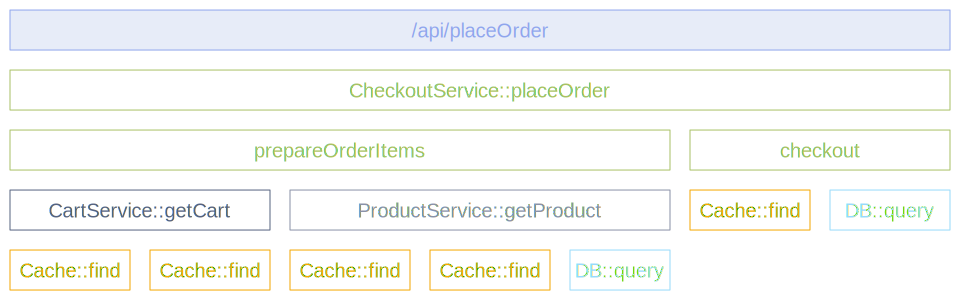

[計装スコープ](/docs/specs/otel/common/instrumentation-scope/)は、送出されたテレメトリーを関連付けられるアプリケーションコード内の論理ユニットを表します。

Developers can decide what denotes a reasonable instrumentation scope. For
example, they can select a module, a package, or a class as the instrumentation
scope. In the case of a library or framework, a common approach is to use an
identifier as scope that is unique to the library or framework, such as a fully
qualified name and version of the library or framework. If the library itself
doesn't have built-in OpenTelemetry instrumentation, and an instrumentation
library is used instead, use the name and version of the instrumentation library
as the instrumentation scope.

計装スコープは、トレーサー、メーター、またはロガーインスタンスがプロバイダーから取得されるとき、名前とバージョンのペアで定義されます。
インスタンスによって作成された各スパン、メトリクス、またはログレコードは、提供された計装スコープに関連付けられます。 Each span, metric, or log
record created by the instance is then associated with the provided
instrumentation scope.

In your observability backend, scoping allows you to slice and dice your
telemetry data by scope, for example to see which of your users are using which
version of a library and what the performance of that library version is or to
pin point a problem to a specific module of your application.

The following diagram illustrates a trace with multiple instrumentation scopes.
次の図は、複数の計装スコープを持つトレースを示しています。異なるスコープは異なる色で表されています。

- 一番上の `/api/placeOrder` スパンは、使用するHTTPフレームワークによって生成されます。
- 緑色のスパン（`CheckoutService::placeOrder`、`prepareOrderItems`、`checkout`）はアプリケーションコードで、`CheckoutService`クラスでグループ化されています。
- `CartService::getCart` と `ProductService::getProduct` のスパンもアプリケーションコードで、`CartService`と`ProductService`クラスでグループ化されています。
- オレンジ色（`Cache::find`）と水色（`DB::query`）のスパンはライブラリコードで、ライブラリ名とバージョンでグループ化されています。

