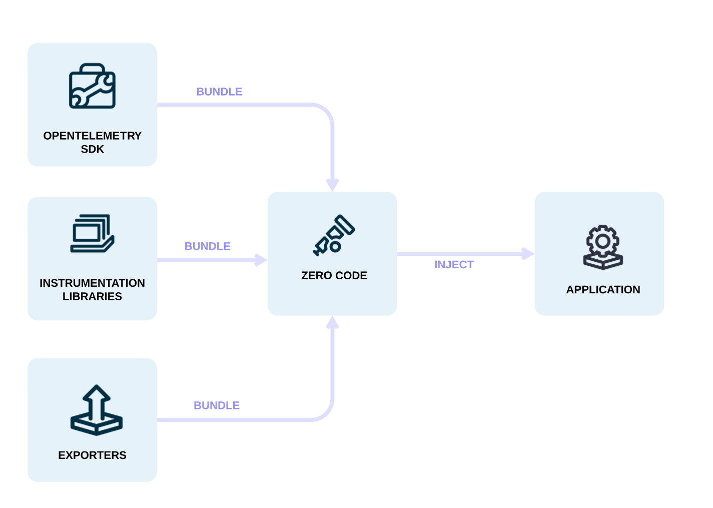

As [ops](/docs/getting-started/ops/) you might want to add observability to one
or more applications without having to edit the source. [運用担当者](/docs/getting-started/ops/)として、ソースを編集することなく、1つ以上のアプリケーションにオブザーバビリティを追加したいと思うかもしれません。
OpenTelemetry を使えば、[コードベースの計装](/docs/concepts/instrumentation/code-based) のための OpenTelemetry API や SDK を使わなくても、サービスのオブザーバビリティを素早く得られます。

ゼロコード計装は、OpenTelemetry API と SDKの機能を使って、通常、エージェントあるいはそれに準ずる機能をアプリケーションに追加します。
具体的なメカニズムは言語によって異なり、バイトコード操作、モンキーパッチ、あるいは eBPF から、アプリケーションにOpenTelemetry APIとSDKへの呼び出しを注入します。 The specific
mechanisms involved may differ by language, ranging from bytecode manipulation,
monkey patching, or eBPF to inject calls to the OpenTelemetry API and SDK into
your application.

Typically, zero-code instrumentation adds instrumentation for the libraries
you're using. This means that requests and responses, database calls, message
queue calls, and so forth are what are instrumented. Your application's code,
however, is not typically instrumented. To instrument your code, you'll need to
use [code-based instrumentation](/docs/concepts/instrumentation/code-based).

さらに、ゼロコード計装では、読み込まれた[計装ライブラリ](/docs/concepts/instrumentation/libraries)や[エクスポーター](/docs/concepts/components/#exporters)を設定を行うことができます。

You can configure zero-code instrumentation through environment variables and
other language-specific mechanisms, such as system properties or arguments
passed to initialization methods. To get started, you only need a service name
configured so that you can identify the service in the observability backend of
your choice.

その他、以下のような設定オプションがあります。

- データソース固有の設定
- エクスポーターの設定
- プロパゲーターの設定
- リソースの設定

Automatic instrumentation is available for the following languages:

- [.NET](/docs/zero-code/dotnet/)
- [Go](/docs/zero-code/go)
- [Java](/docs/zero-code/java/)
- [JavaScript](/docs/zero-code/js/)
- [PHP](/docs/zero-code/php/)
- [Python](/docs/zero-code/python/)
