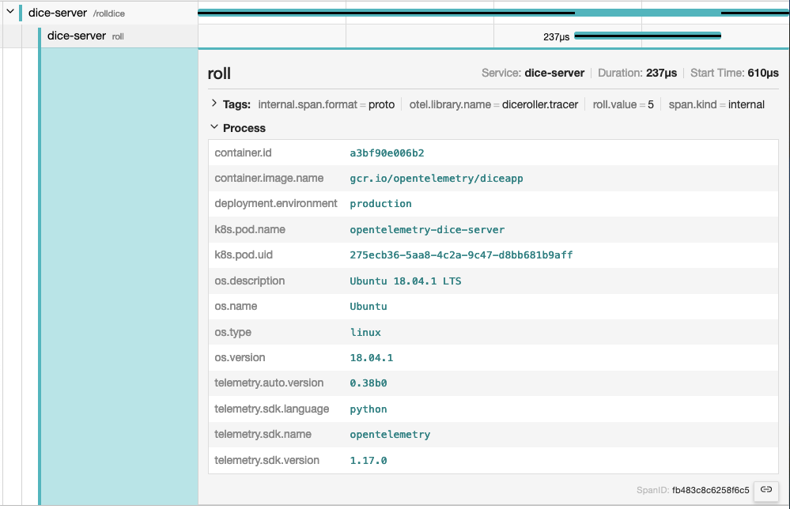

## はじめに {#introduction}

{}

オブザーバビリティバックエンドに[Jaeger](https://www.jaegertracing.io/)を使用している場合、リソース属性は**Process**タブの下にグループ化されます。



A resource is added to the `TracerProvider` or `MetricProvider` when they are
created during initialization. This association cannot be changed later. リソースは `TracerProvider` または `MetricProvider` の初期化時に追加されます。
この関連付けは後で変更することはできません。
リソースが追加されると、そのプロバイダーに紐づいた `Tracer` または `Meter` から生成されるすべてのスパンとメトリクスに、そのリソースが関連付けられます。

## SDKが提供するデフォルト値を持つセマンティック属性 {#semantic-attributes-with-sdk-provided-default-value}

There are attributes provided by the OpenTelemetry SDK. One of them is the
`service.name`, which represents the logical name of the service. OpenTelemetry SDK が提供する属性があります。
そのうちの1つが `service.name` で、これはサービスの論理名を表します。
デフォルトでは、SDKはこの値に `unknown_service` を代入するので、コードの中で明示的に設定するか、環境変数 `OTEL_SERVICE_NAME` を設定することを推奨します。

さらに、SDKは自身を識別するために、`telemetry.sdk.name`、`telemetry.sdk.language`、`telemetry.sdk.version` といったリソース属性も提供します。

## リソース検出器 {#resource-detectors}

ほとんどの言語固有のSDKは、環境からリソース情報を自動的に検出できるリソース検出器のセットを提供しています。
一般的なリソース検出器には次のようなものがあります。 Common
resource detectors include:

- [オペレーティングシステム](/docs/specs/semconv/resource/os/)
- [ホスト](/docs/specs/semconv/resource/host/)
- [プロセスとプロセスランタイム](/docs/specs/semconv/resource/process/)
- [コンテナ](/docs/specs/semconv/resource/container/)
- [Kubernetes](/docs/specs/semconv/resource/k8s/)
- [クラウドプロバイダー固有の属性](/docs/specs/semconv/resource/#cloud-provider-specific-attributes)
- [その他](/docs/specs/semconv/resource/)

## カスタムリソース

You can also provide your own resource attributes. You can either provide them
in code or via populating the environment variable `OTEL_RESOURCE_ATTRIBUTES`.
If applicable, use the
[semantic conventions for your resource attributes](/docs/specs/semconv/resource).
For example, you can provide the name of your
[deployment environment](/docs/specs/semconv/resource/deployment-environment/)
using `deployment.environment.name`:

```shell
env OTEL_RESOURCE_ATTRIBUTES=deployment.environment.name=production yourApp
```
