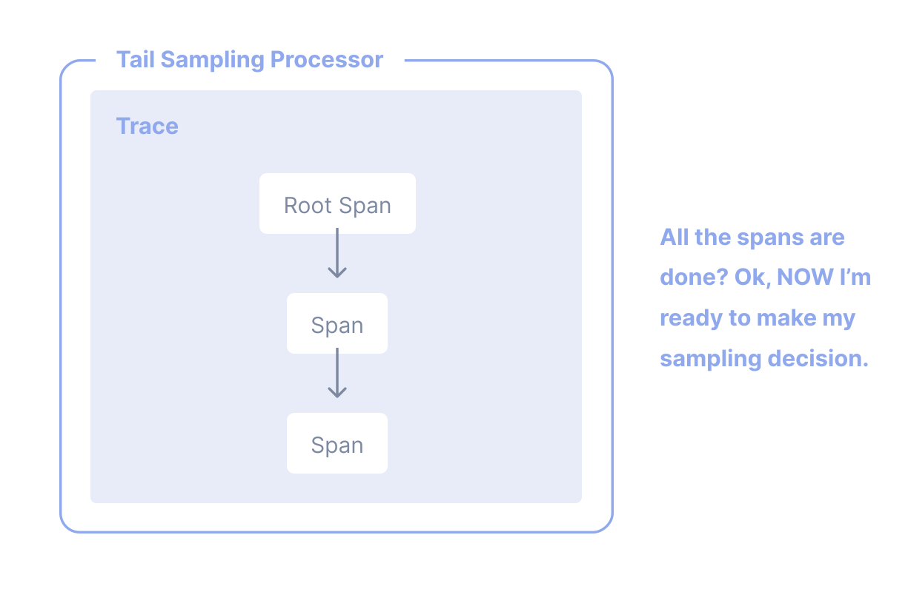

分散システムでは、[トレース](/docs/concepts/signals/traces)で、リクエストが分散システム内のあるサービスから別のサービスに移動するのを観察できます。
トレーシングはシステムの高レベルな分析と詳細な分析の両方において、非常に実用的です。 Tracing is highly
practical for both high-level and in-depth analysis of systems.

しかし、リクエストの大半が成功し、許容できるレイテンシーでエラーもなく終了する場合、アプリケーションとシステムを有意義に観測するのに、トレースの 100 % を必要としません。
適切なサンプリングが必要なだけです。 You just need the right
sampling.

## 用語解説 {#terminology}

It's important to use consistent terminology when discussing sampling. A trace
or span is considered "sampled" or "not sampled":

- **Sampled**: A trace or span is processed and exported. Because it is chosen
  by the sampler as a representative of the population, it is considered
  "sampled".
- **サンプリングされていない**: トレースまたはスパンは、処理またはエクスポートされません。サンプラーによって選択されていないため、「サンプリングされていない」とみなされます。 Because it is
  not chosen by the sampler, it is considered "not sampled".

Sometimes, the definitions of these terms get mixed up. ときどきこれらの用語の定義が混同されることがあります。
誰かが「データをサンプリングアウトしている」と言ったり、処理またはエクスポートされていないデータは「サンプリングされた」と見なされると言ったりするのを見かけるかもしれません。
これらは間違った表現です。 These are incorrect statements.

## なぜサンプリングするのか？ {#why-sampling}

Sampling is one of the most effective ways to reduce the costs of observability
without losing visibility. Although there are other ways to lower costs, such as
filtering or aggregating data, these other methods do not adhere to the concept
of representativeness, which is crucial when performing in-depth analysis of
application or system behavior.

Representativeness is the principle that a smaller group can accurately
represent a larger group. 代表性は、小さな集合が大きな集合を正確に表しているという原則です。
さらに、代表性は数学的に検証可能であるため、小さなデータサンプルが大きなグループを正確に反映していることに高い確信を持つことができます。

Additionally, the more data you generate, the less data you actually need to
have a representative sample. For high-volume systems, is quite common for a
sampling rate of 1% or lower to very accurately represent the other 99% of data.

### サンプリングすべきとき {#when-to-sample}

もし、次のいずれかを基準の満たす場合、サンプリングを検討してください。

- 1 秒あたり 1000 件以上のトレースを生成している。
- ほとんどのトレースデータが健全なトラフィックを表しており、データの変動が少ない。
- エラーや高レイテンシーなど、問題が発生していることを示す共通の指標がある。
- エラーやレイテンシー以外にも、関連するデータを特定するためのドメイン固有の基準を持っている。
- データをサンプリングするか破棄するかを決定する共通のルールを述べることができる
- You have a way to tell your services apart, so that high- and low-volume
  services are sampled differently.
- サンプリングされなかったデータを（「念のため」のシナリオのために）低コストのストレージシステムに保存できる

Finally, consider your overall budget. If you have limited budget for
observability, but can afford to spend time to effectively sample, then sampling
can generally be worth it.

### サンプリングすべきでないとき {#when-not-to-sample}

Sampling might not be appropriate for you. You might want to avoid sampling if
you meet any of the following criteria:

- 非常に少ないデータ（1 秒あたり 10 件あたりの小さなトレースまたは、それよりも少ない）を生成している。
- You only use observability data in aggregate, and can thus pre-aggregate data.
- 規則などの事情によりデータの削除が禁止されている（そして、低コストのストレージにサンプルされていなデータを保存できない）。

最後に、サンプリングに関する 3 つのコストを考慮してください。

1. テイルサンプリングプロキシといった、データを効果的にサンプリングするための計算リソースの直接的なコスト。
2. 関連するアプリケーション、システム、データが増えるにつれて、効果的なサンプリング手法を維持するための間接的なエンジニアリングのコスト。
3. 効果的でないサンプリング技術によって重要な情報を見逃すことによる間接的な機会コスト。

Sampling, while effective at reducing observability costs, might introduce other
unexpected costs if not performed well. It could be cheaper to allocate more
resources for observability instead, either with a vendor or compute when
self-hosting, depending on your observability backend, the nature of your data,
and your attempts to sample effectively.

## ヘッドサンプリング {#head-sampling}

Head sampling is a sampling technique used to make a sampling decision as early
as possible. A decision to sample or drop a span or trace is not made by
inspecting the trace as a whole.

たとえば、ヘッドサンプリングのもっとも一般的な形式は、[一貫した確率サンプリング](/docs/specs/otel/trace/tracestate-probability-sampling-experimental/#consistent-probability-sampling)です。
決定論的サンプリングと呼ばれることもあります。
この場合、サンプリングの決定は、トレースIDと、サンプリングするトレースの望ましい割合に基づいて行われます。
これにより、全トレースの5%など、一貫した割合で、スパンの欠損無く、全トレースがサンプリングされます。
This is also be referred to as Deterministic Sampling. In this case, a sampling
decision is made based on the trace ID and the desired percentage of traces to
sample. This ensures that whole traces are sampled - no missing spans - at a
consistent rate, such as 5% of all traces.

ヘッドサンプリングの利点は以下の通りです。

- わかりやすい
- 設定しやすい
- 効果的
- トレース収集パイプラインのどの時点でも可能

The primary downside to head sampling is that it is not possible to make a
sampling decision based on data in the entire trace. For example, you cannot
ensure that all traces with an error within them are sampled with head sampling
alone. For this situation and many others, you need tail sampling.

## テイルサンプリング {#tail-sampling}

Tail sampling is where the decision to sample a trace takes place by considering
all or most of the spans within the trace. Tail Sampling gives you the option to
sample your traces based on specific criteria derived from different parts of a
trace, which isn’t an option with Head Sampling.

テイルサンプリングの使い方の例としては、以下のようなものがあります。

- エラーを含むトレースを常にサンプリングする
- 全体的なレイテンシーに基づいてトレースをサンプリングする
- トレース内の1つまたは複数のスパンにおける特定の属性の存在または値に基づいてトレースをサンプリングする。たとえば、新しくデプロイされたサービスからより多くのトレースをサンプリングする。
- 低トラフィックのサービスのトレースと高トラフィックのサービスのトレースのように、特定の基準に基づいてトレースに異なるサンプリングレートを適用する

As you can see, tail sampling allows for a much higher degree of sophistication
in how you sample data. For larger systems that must sample telemetry, it is
almost always necessary to use Tail Sampling to balance data volume with the
usefulness of that data.

There are three primary downsides to tail sampling today:

1. Tail sampling can be difficult to implement. Depending on the kind of
   sampling techniques available to you, it is not always a "set and forget"
   kind of thing. As your systems change, so too will your sampling strategies.
   For a large and sophisticated distributed system, rules that implement
   sampling strategies can also be large and sophisticated.
2. Tail sampling can be difficult to operate. The component(s) that implement
   tail sampling must be stateful systems that can accept and store a large
   amount of data. Depending on traffic patterns, this can require dozens or
   even hundreds of compute nodes that all utilize resources differently.
   Furthermore, a tail sampler might need to "fall back" to less computationally
   intensive sampling techniques if it is unable to keep up with the volume of
   data it is receiving. Because of these factors, it is critical to monitor
   tail-sampling components to ensure that they have the resources they need to
   make the correct sampling decisions.
3. Tail samplers often end up as vendor-specific technology today. If you're
   using a paid vendor for Observability, the most effective tail sampling
   options available to you might be limited to what the vendor offers.

Finally, for some systems, tail sampling might be used in conjunction with Head
Sampling. For example, a set of services that produce an extremely high volume
of trace data might first use head sampling to sample only a small percentage of
traces, and then later in the telemetry pipeline use tail sampling to make more
sophisticated sampling decisions before exporting to a backend. This is often
done in the interest of protecting the telemetry pipeline from being overloaded.

## サポート {#support}

### コレクター {#collector}

OpenTelemetryコレクターには、以下のサンプリングプロセッサーがあります。

- [Probabilistic Sampling Processor（確率的サンプリングプロセッサー）](https://github.com/open-telemetry/opentelemetry-collector-contrib/tree/main/processor/probabilisticsamplerprocessor)
- [Tail Sampling Processor（テイルサンプリングプロセッサー）](https://github.com/open-telemetry/opentelemetry-collector-contrib/tree/main/processor/tailsamplingprocessor)

### 言語SDK {#language-sdks}

OpenTelemetry API & SDK の各言語固有の実装については、それぞれのドキュメントページでサンプリングのサポート状況を確認出来ます。

{}

### Vendors

Many [vendors](/ecosystem/vendors) offer comprehensive sampling solutions that
incorporate head sampling, tail sampling, and other features that can support
sophisticated sampling needs. These solutions may also be optimized specifically
for the vendor's backend. If you are sending telemetry to a vendor, consider
using their sampling solutions.
