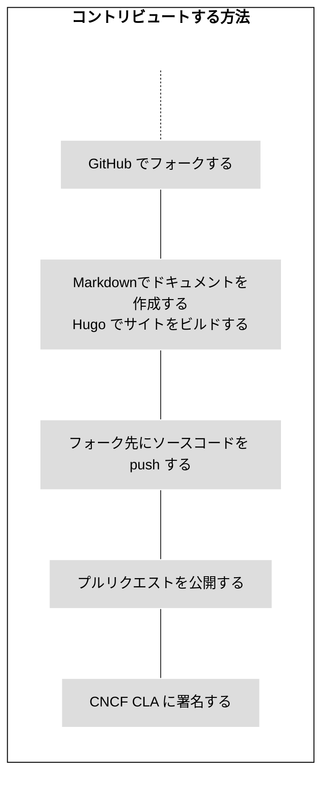
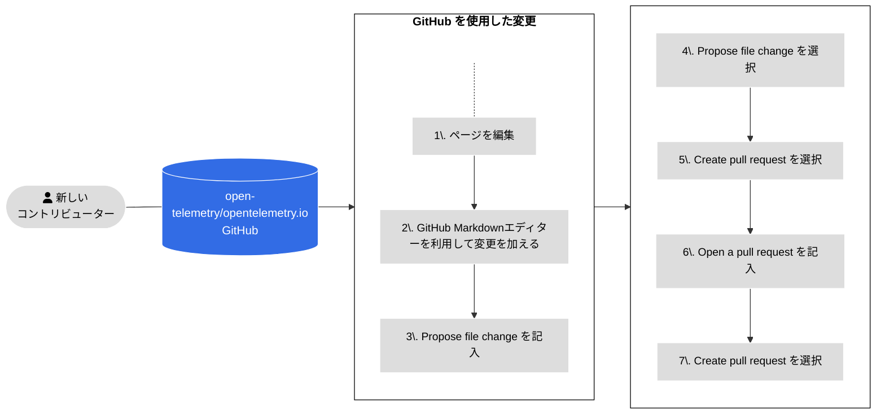
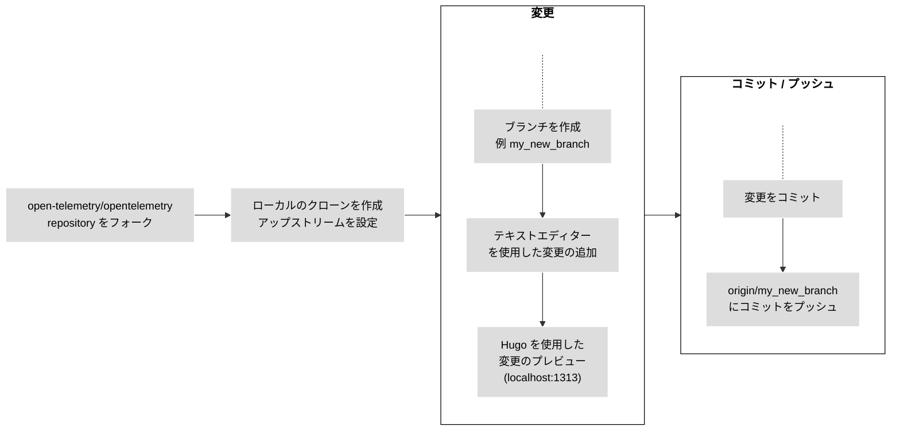
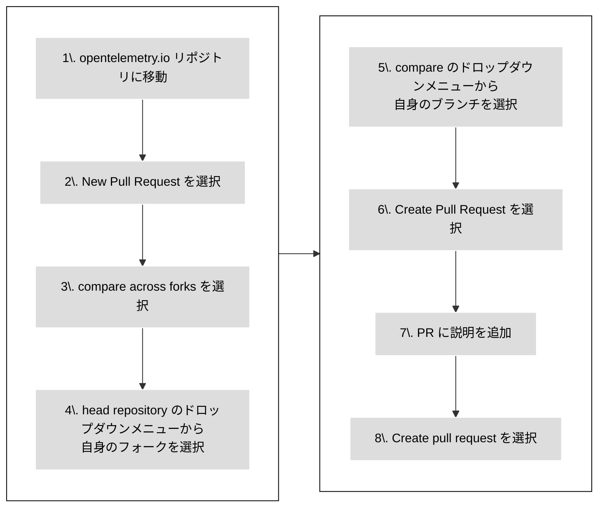

新しいドキュメントの内容を追加や改善するには、[プルリクエスト][PR] （PR）を提出してください。

- もし変更が小さかったり、自身が [Git] に慣れていなかったら、[GitHub を使用](#changes-using-github)を参照しページの編集方法を学んでください。
- もしくは、[ローカルのフォークから作業する](#fork-the-repo)を参照し、ローカルのコンピュータから変更を行う方法を学んでください。

{}

All contributors are required to [sign a Contributor License Agreement
(CLA)][CLA] before changes can be reviewed and merged.

[CLA]: ../prerequisites/#cla

{}

{}

コンテンツがレビューの準備ができていないことをメンテナーに知らせるために、プルリクエストのステータスを **Draft** にしてください。
メンテナーは、Draft ステータスを解除するまでコンテンツを完全なレビューはしませんが、コメントや高レベルのレビューを行うことがあります。 Maintainers may still comment or do
high-level reviews, though they won't review the content in full until you
remove the draft status.

{}

以下の図は新しいドキュメントにコントリビュートする方法を示しています。



_図 1. 新しいコンテンツにコントリビュートする。_

## GitHub を使用 {#changes-using-github}

### ブラウザから修正し変更を提出する {#page-edit-from-browser}

If you're less experienced with Git workflows, here's an easier method of
preparing and opening a new pull request (PR). Figure 2 outlines the steps and
the details follow.



_図 2. GitHub を利用した PR の公開手順。_

1. 問題を見つけたページ上で、右側のナビゲーションパネルにある **ページの編集** のオプションを選択してください。

2. プロジェクトのメンバーでない場合、GitHub でリポジトリのフォークの作成を提案されます。**Fork this repository**を選択してください。 Select **Fork this repository**.

3. GitHub のエディターで、変更を加えます。

4. **Propose file change** フォームに記入してください。

5. **Propose file change** を選択します。

6. **Create Pull request** を選択します。

7. **Open a pull request** 画面に表示されます。あなたの説明はレビュアーが理解するのに役立ちます。 Your description helps reviewers
   understand your change.

8. **Create pull request**を選択してください。

プルリクエストをマージする前に、OpenTelemetry コミュニティメンバーはレビューして承認します。

レビュアーから変更を求められた場合。

1. **File changed**タブに移動してください。
2. プルリクエストによって変更されたファイルのいずれかで、鉛筆（編集）アイコンを選択します。
3. Make the changes requested. If there's a code suggestion, apply it.
4. 変更をコミットしてください。

レビューが完了したら、レビュアーは PR をマージして変更が数分後に反映されます。

### Fixing PR check failures {#fixing-prs-in-github}

PR を提出した後に、GitHub はいくつかのビルドチェックを実行します。
フォーマットの問題といった、特定のチェックの失敗は自動的に修正できます。 Certain check
failures, like formatting issues, can be fixed automatically.

以下のコメントを PR に追加してください。

```text
/fix:all
```

これは、OpenTelemetry bot がビルドの問題を修正しようとします。
もしくは、特定の失敗に対処するために、次の修正コマンドの 1 つを実行できます。 Or you can
issue one of the following fix commands to address a specific failure:

```text
fix:dict
fix:expired
fix:filenames
fix:format
fix:htmltest-config
fix:i18n
fix:markdown
fix:refcache
fix:submodule
fix:text
```

{}

You can also run the `fix` commands locally. `fix` コマンドをローカルで実行できます。
修正コマンドの全リストは、`npm run -s '_list:fix:*'` を実行してください。

{}

## ローカルで作業する {#fork-the-repo}

Git に慣れている場合もしくは、変更が数行以上の場合は、ローカルのフォークから作業してください。

パソコンに [git がインストール済み][`git` installed]であることを確認してください。
Git のユーザーインターフェースも利用できます。 You can also use a user
interface for Git.

図 3 は、ローカルのフォークから作業するときに従う手順を示しています。詳細はそれぞれの手順に従ってください。 The details
for each step follow.



_図 3. ローカルのフォークで作業して変更を追加。_

### リポジトリをフォークする {#fork-the-repository}

1. [`opentelemetry.io`](https://github.com/open-telemetry/opentelemetry.io/) リポジトリに移動してください。
2. **フォーク**を選択してください。

### クローンし、アップストリームを設定 {#clone-and-set-upstream}

1. ターミナルウィンドウで、フォークをクローンし、必要なものをインストールしてください。

   ```shell
   git clone git@github.com:<your_github_username>/opentelemetry.io.git
   cd opentelemetry.io
   npm install
   ```

2. `open-telemetry/opentelemetry.io` リポジトリを `upstream` リモートに設定。

   ```shell
   git remote add upstream https://github.com/open-telemetry/opentelemetry.io.git
   ```

3. `origin` と `upstream` リポジトリの確認。

   ```shell
   git remote -v
   ```

   出力は以下のようになります。

   ```none
   origin	git@github.com:<your_github_username>/opentelemetry.io.git (fetch)
   origin	git@github.com:<your_github_username>/opentelemetry.io.git (push)
   upstream	https://github.com/open-telemetry/opentelemetry.io.git (fetch)
   upstream	https://github.com/open-telemetry/opentelemetry.io.git (push)
   ```

4. フォークの `origin/main` と `open-telemetry/opentelemetry.io` の `upstream/main` からコミットをフェッチ。

   ```shell
   git fetch origin
   git fetch upstream
   ```

   This makes sure your local repository is up to date before you start making
   changes. Push changes from upstream to origin regularly to keep your fork in
   sync with upstream.

### ブランチを作成 {#create-a-branch}

1. Create a new branch. This example assumes the base branch is `upstream/main`:

   ```shell
   git checkout -b <my_new_branch> upstream/main
   ```

2. コードエディターまたはテキストエディターを使用して変更を加えてください。

いつでも、`git status` コマンドを使用して、どのファイルが変更したか確認できます。

### 変更のコミット {#commit-your-changes}

プルリクエストを提出する準備ができたら、変更をコミットしてください。

1. ローカルリポジトリで、コミットが必要なファイルを確認してください。

   ```shell
   git status
   ```

   出力は次のようになります。

   ```none
   On branch <my_new_branch>
   Your branch is up to date with 'origin/<my_new_branch>'.

   Changes not staged for commit:
   (use "git add <file>..." to update what will be committed)
   (use "git checkout -- <file>..." to discard changes in working directory)

   modified:   content/en/docs/file-you-are-editing.md

   no changes added to commit (use "git add" and/or "git commit -a")
   ```

2. **Changes not staged for commit** のリストされているファイルをコミットしてください。

   ```shell
   git add <your_file_name>
   ```

   これを各ファイルに対して繰り返してください。

3. すべてのファイルを追加した後に、 コミットを作成してください。

   ```shell
   git commit -m "Your commit message"
   ```

4. ローカルブランチと新しいコミットをリモートのフォークにプッシュしてください。

   ```shell
   git push origin <my_new_branch>
   ```

5. 変更がプッシュされると、GitHub が PR を作成できることを知らせます。

### 新しいプルリクエストを公開する {#open-a-pr}

図 4 はフォークから [opentelemetry.io](https://github.com/open-telemetry/opentelemetry.io) への PR を開く手順を示しています。



_図 4. フォークから、PR を公開する手順_
[opentelemetry.io](https://github.com/open-telemetry/opentelemetry.io).

1. Web ブラウザで [`opentelemetry.io`](https://github.com/open-telemetry/opentelemetry.io) リポジトリにアクセスしてください。

2. **New Pull Request** を作成してください。

3. **compare across forks** を選択してください。

4. **head repository** ドロップダウンメニューから、あなたのフォークを選択してください。

5. ドロップダウンメニューの **compare** から、あなたのブランチを選択してください。

6. **Create Pull Request** を選択してください。

7. プルリクエストの説明を追加してください。
   - **タイトル** (50 文字未満): 変更の意図を要約してください。
   - **説明**: 変更を詳細に記述してください。
     - GitHub イシューに関連する場合、`Fixes #12345` や `Closes #12345` を説明に記述することで、PR のマージしたあとに GitHub の自動化が該当イシューをクローズします。 他の関連する PR がある場合もリンクしてください。 If there are other related PRs,
       link those as well.
     - If you want advice on something specific, include any questions you'd
       like reviewers to think about in your description.

8. **Create pull request** ボタンを選択してください。

プルリクエストは、[Pull requests](https://github.com/open-telemetry/opentelemetry.io/pulls) で確認できます。

PR を公開した後に、自動テストの実行と [Netlify](https://www.netlify.com/) を使用したプレビューのデプロイを試みます。

- Netlify ビルドが失敗した場合、詳細な情報のために **Details** を選択してください。
- Netlify のビルドが成功した場合、**Details** を選択して、変更が適用された OpenTelemetry のウェブサイトのステージングバージョンを開いてください。 これがレビュアーが変更を確認する方法です。 This is how reviewers
  check your changes.

他のチェックも同様に失敗している可能性があります。[すべての PR チェック](../pr-checks) を参照してください。 See the [list of all PR checks](../pr-checks).

### 問題を修正する {#fix-issues}

リポジトリに変更を提出するまえに、以下のコマンドを実行して (i) 報告された問題の対応し、(ii) スクリプトによって変更されたファイルのコミットをしてください。

```sh
npm run test-and-fix
```

ファイルに対して、テストとすべての問題の修正を分割して実行するには、以下を実行してください。

```sh
npm run test    # ファイルを更新せずにチェックのみを実行します
npm run fix:all # ファイルを更新する場合があります。
```

利用可能な NPM スクリプトのリストを表示するには、`npm run` を実行してください。
プルリクエストのチェックとエラーの自動修正の詳細は、[PR checks](../pr-checks) を参照してください。 See [PR checks](../pr-checks) for
more information on pull request checks and how to fix errors automatically.

### 変更をプレビューする {#preview-locally}

Preview your changes locally before pushing them or opening a pull request. A
preview lets you catch build errors or Markdown formatting problems.

Hugo をローカルでビルドと提供するには、以下のコマンドを実行してください。

```shell
npm run serve
```

Navigate to <http://localhost:1313> in your web browser to see the local
preview. Hugo watches for changes and rebuilds the site as needed.

ローカルの Hugo インスタンスを停止するには、ターミナルにもどって `Ctrl+C` を入力するか、ターミナルを閉じてください。

### サイトデプロイと PR プレビュー {#site-deploys-and-pr-previews}

PR を提出したら、Netlify は [deploy preview][] を作成し、変更をレビューできます。
PR がマージされると、Netlify はプロダクションサーバーに更新されたサイトを本番サーバーにデプロイします。 Once your PR is merged, Netlify deploys the updated site to the
production server.

> **Note**: PR プレビューには ドラフトページ が含まれますが、本番ビルドには含まれません。

デプロイログなどを確認するには、プロジェクトの [dashboard][] を確認してください。
Netlify ログインが必要です。

### PR ガイドライン {#pr-guidelines}

Before a PR gets merged, it sometimes requires a few iterations of
review-and-edit. To help us and yourself make this process as easy as possible,
we ask that you adhere to the following:

- もしあなたの PR が簡単な修正でない場合は、**フォークから作業**してください。 リポジトリの上部にある [Fork](https://github.com/open-telemetry/opentelemetry.io/fork) ボタンをクリックし、フォークをローカルにクローンしてください。準備ができたら、アップストリームリポジトリに PR を作成してください。 When you are ready, raise a
  PR with the upstream repository.
- **Do not work from the `main`** branch of your fork, but create a PR-specific
  branch.
- メンテナーが[あなたのプルリクエストに変更を加えられること](https://docs.github.com/ja/pull-requests/collaborating-with-pull-requests/working-with-forks/allowing-changes-to-a-pull-request-branch-created-from-a-fork)を確認してください。

### レビュアーからの変更 {#changes-from-reviewers}

Sometimes reviewers commit to your pull request. Before making any other
changes, fetch those commits.

1. リモートフォークからコミットをフェッチして、作業中のブランチをリベースしてください。

   ```shell
   git fetch origin
   git rebase origin/<your-branch-name>
   ```

2. After rebasing, force-push new changes to your fork:

   ```shell
   git push --force-with-lease origin <your-branch-name>
   ```

You can also solve merge conflicts from the GitHub UI.

### Merge conflicts and rebasing

別のコントリビューターが別の PR で同じファイルに変更をコミットすると、マージコンフリクトが発生する可能性があります。
あなたの PR ですべてのマージコンフリクトを解決する必要があります。 You must resolve all merge conflicts in your PR.

1. フォークを更新して、ローカルブランチをリベースしてください。

   ```shell
   git fetch origin
   git rebase origin/<your-branch-name>
   ```

   Then force-push the changes to your fork:

   ```shell
   git push --force-with-lease origin <your-branch-name>
   ```

2. `open-telemetry/opentelemetry.io` の `upstream/main` から変更をフェッチして、あなたのブランチをリベースしてください。

   ```shell
   git fetch upstream
   git rebase upstream/main
   ```

3. リベースの結果を確認してください。

   ```shell
   git status
   ```

   これにより、多くのファイルがコンフリクトとしてマークされます。

4. Open each conflicted file and look for the conflict markers: `>>>`, `<<<`,
   and `===`. Resolve the conflict and delete the conflict marker.

   詳細は、[How conflicts are presented](https://git-scm.com/docs/git-merge#_how_conflicts_are_presented) を確認してください。

5. ファイルをチェンジセットに追加してください。

   ```shell
   git add <filename>
   ```

6. Continue the rebase:

   ```shell
   git rebase --continue
   ```

7. ステップ 2 から 5 を必要に応じて繰り返してください。

   すべてのコミットを適用した後、`git status` コマンドはリベースが完了したことを示します。

8. Force-push the branch to your fork:

   ```shell
   git push --force-with-lease origin <your-branch-name>
   ```

   The pull request no longer shows any conflicts.

### Merge requirements

プルリクエストは、以下の条件を満たしたときにマージされます。

- 承認者、メンテナー、技術委員会メンバー、または専門家によるすべてのレビューが "Approved" ステータスであること。
- 解決していない会話がないこと。
- 最低 1 人の承認者によって承認されていること。
- 失敗している PR チェックがないこと。
- PR branch is up-to-date with the base branch.
- ドキュメントページの変更が[ロケールをまたいでいないこと][do not span locales]

[do not span locales]: ../localization/#prs-should-not-span-locales

> **重要**
>
> PR チェックの失敗についてあまり心配しないでください。
> コミュニティメンバーが修正方法を教えたり、代わりに修正したりしてくれます。 Community members will help you
> to get them fixed, by either providing you with instructions how to fix them
> or by fixing them on your behalf.

[dashboard]: https://app.netlify.com/sites/opentelemetry/overview
[deploy preview]: https://www.netlify.com/blog/2016/07/20/introducing-deploy-previews-in-netlify/
[Git]: https://docs.github.com/en/get-started/using-git/about-git
[`git` installed]: https://git-scm.com/book/en/v2/Getting-Started-Installing-Git
[PR]: https://docs.github.com/en/pull-requests
