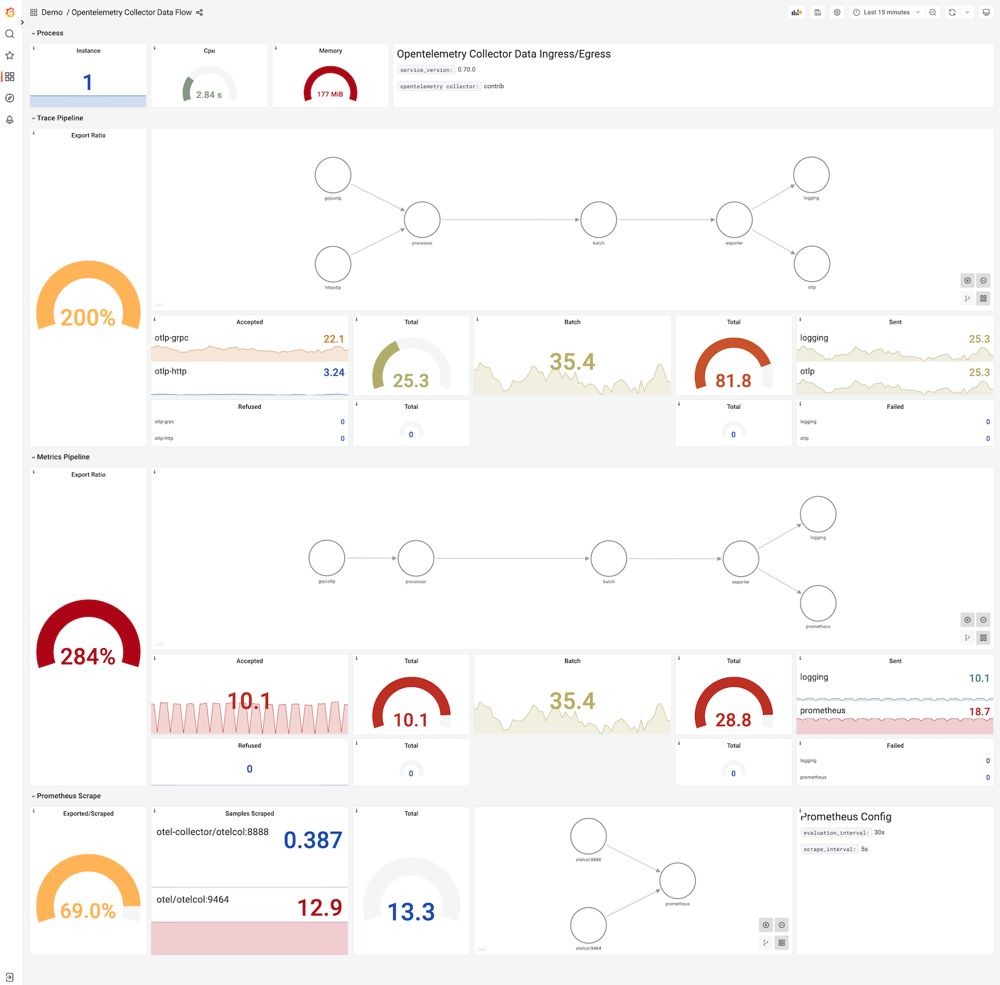
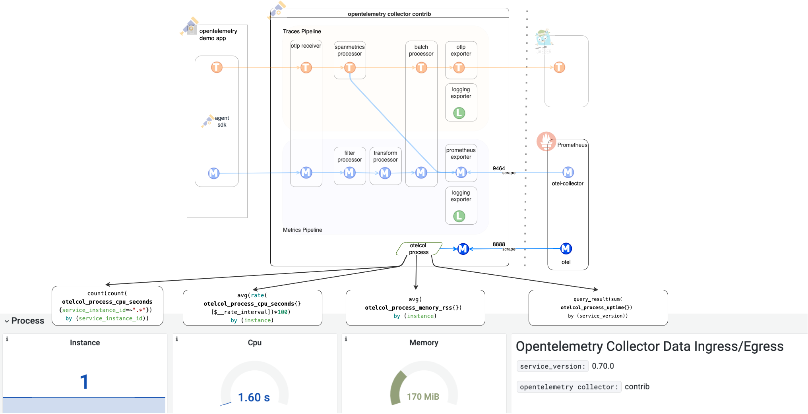

OpenTelemetryコレクターを通じてデータフローを監視することは、いくつかの重要な理由があります。サンプル数やカーディナリティなど、入力されるデータのマクロレベルの視点を得ることは、コレクターの内部動作を理解する上で不可欠です。しかし、詳細に踏み込むと、相互接続が複雑になる可能性があります。コレクターデータフローダッシュボードは、OpenTelemetryデモアプリケーションの機能を示すことを目的としており、ユーザーが構築するための基盤を提供します。 Gaining a macro-level perspective on incoming data, such as sample
counts and cardinality, is essential for comprehending the collector's internal
dynamics. However, when delving into the details, the interconnections can
become complex. The Collector Data Flow Dashboard aims to demonstrate the
capabilities of the OpenTelemetry demo application, offering a solid foundation
for users to build upon. コレクターデータフローダッシュボードは、監視すべきメトリクスについて重要なガイダンスを提供します。ユーザーは、memory_delimiterプロセッサーやその他のデータフロー指標など、自身のユースケースに合わせた必要なメトリクスを追加することで、独自のダッシュボードを作成できます。デモダッシュボードは出発点として機能し、ユーザーが多様な利用シナリオを探索し、独自の監視ニーズに合わせてツールを適応させることを可能にします。 Users can tailor their own dashboard
variations by adding necessary metrics specific to their use cases, such as
memory_delimiter processor or other data flow indicators. This demo dashboard
serves as a starting point, enabling users to explore diverse usage scenarios
and adapt the tool to their unique monitoring needs.

## データフローの概要 {#data-flow-overview}

以下の図は、システムコンポーネントの概要を示しており、OpenTelemetryデモアプリケーションで使用されているOpenTelemetryコレクター（otelcol）設定ファイルから導き出された構成を示しています。さらに、システム内のオブザーバビリティデータ（トレースとメトリクス）の流れを強調しています。 Additionally, it highlights
the observability data (traces and metrics) flow within the system.

## Ingress/Egress Metrics

The metrics depicted in the diagram below are employed to monitor both egress
and ingress data flows. These metrics are generated by the otelcol process,
exported on port 8888, and subsequently scraped by Prometheus. The namespace
associated with these metrics is "otelcol," and the job name is labeled as
`otel.`

Labels serve as a valuable tool for identifying specific metric sets (such as
exporter, receiver, or job), enabling differentiation among metric sets within
the overall namespace. It is important to note that you will only encounter
refused metrics if the memory limits, as defined in the memory delimiter
processor, are exceeded.

### Ingress Traces Pipeline

- `otelcol_receiver_accepted_spans`
- `otelcol_receiver_refused_spans`
- `by (receiver,transport)`

### Ingress Metrics Pipeline

- `otelcol_receiver_accepted_metric_points`
- `otelcol_receiver_refused_metric_points`
- `by (receiver,transport)`

### プロセッサーに関するメトリクス {#processor}

現在、デモアプリケーションに存在する唯一のプロセッサーはバッチプロセッサーであり、これはトレースとメトリクスの両方のパイプラインで使用されています。

- `otelcol_processor_batch_batch_send_size_sum`

### Egress Traces Pipeline

- `otelcol_exporter_sent_spans`
- `otelcol_exporter_send_failed_spans`
- `by (exporter)`

### メトリクスパイプラインのエグレスに関するメトリクス {#egress-metrics-pipeline}

- `otelcol_exporter_sent_metric_points`
- `otelcol_exporter_send_failed_metric_points`
- `by (exporter)`

### Prometheusスクレイピング

- `scrape_samples_scraped`
- `by (job)`

## ダッシュボード {#dashboard}

Grafana UIにアクセスし、画面左側のブラウズアイコンから**OpenTelemetry Collector Data Flow** ダッシュボードを選択することで、ダッシュボードにアクセスできます。

ダッシュボードは4つのセクションから構成されています。

1. プロセスメトリクス
2. Traces Pipeline
3. Metrics Pipeline
4. Prometheusのスクレイピングに関するメトリクス {#prometheus-scraping}

Sections 2,3 and 4 represent overall data flow using the metrics mentioned
above. セクション 2, 3, 4 は上述のメトリクスを使用してデータフロー全体を示しています。さらに、データフローを理解するために、各パイプラインのエクスポート比率が計算されています。

### エクスポート比率 {#export-ratio}

Export ratio is basically the ratio between receiver and exporter metrics. You
can notice over the dashboard screenshot above that the export ratio on metrics
is way too high than the received metrics. This is because the demo application
is configured to generate span metrics which is a processor that generates
metrics from spans inside collector as illustrated in overview diagram.

### プロセスメトリクス {#process-metrics}

Very limited but informative process metrics are added to dashboard. For
example, you might observe more than one instance of otelcol running on the
system during restarts or similar. This can be useful for understanding spikes
on dataflow.

