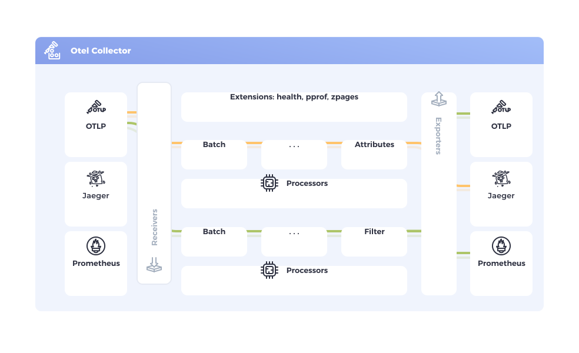

## 简介 {#introduction}

OpenTelemetry Collector 提供了一种与厂商中立的实现方式，用于接收、处理和导出遥测数据。
它省去了运行、操作和维护多个代理/收集器的需要。这种方式具有更好的可扩展性，
并支持开源可观测性数据格式（例如 Jaeger、Prometheus、Fluent Bit 等），可将数据发送到一个或多个开源或商业后端。 It removes the need to run, operate,
and maintain multiple agents/collectors. This works with improved scalability
and supports open source observability data formats (e.g. Jaeger, Prometheus,
Fluent Bit, etc.) sending to one or more open source or commercial backends.

## 目标 {#objectives}

- _Usability_: Reasonable default configuration, supports popular protocols,
  runs and collects out of the box.
- **性能**：在不同负载和配置下都具有高度稳定性和高性能。
- **可观测性**：作为可观测服务的典范。
- **可扩展性**：可在不修改核心代码的前提下进行自定义。
- **统一性**：统一代码库，既可作为代理也可作为收集器部署，支持链路、指标和日志。

## 何时使用 Collector {#when-to-use-a-collector}

For most language specific instrumentation libraries you have exporters for
popular backends and OTLP. You might wonder,

> 在什么情况下应该使用 Collector 来发送数据，而不是让每个服务直接发送到后端？

在尝试或入门 OpenTelemetry 时，直接将数据发送到后端是快速获取价值的好方法。
同样地，在开发或小规模环境中，即使不使用 Collector 也能获得不错的效果。 Also, in a
development or small-scale environment you can get decent results without a
collector.

然而，通常我们建议你在服务旁边使用一个 Collector，因为它能让服务快速卸载数据，而
Collector 可以处理如重试、批处理、加密甚至敏感数据过滤等额外操作。

实际上，[配置 Collector](quick-start) 比你想象的要简单：每种语言的默认
OTLP 导出器都假定 Collector 在本地运行，因此只要你启动 Collector，它就会自动开始接收遥测数据。

## Collector 安全性 {#collector-security}

请遵循最佳实践，确保你的 Collector 被[安全托管][hosted]并[正确配置][configured]。

## 状态 {#status}

**Collector** 的当前状态为：[混合][mixed]，因为核心 Collector
组件当前具有不同的[稳定性等级][stability levels]。

**Collector components** differ in their maturity levels. Each component has its
stability documented in its `README.md`. You can find a list of all available
Collector components in the [registry][].

Support is guaranteed for Collector software artifacts for a certain time period
based on the artifact's intended audience. This support includes, at minimum,
fixes for critical bugs and security issues. See the
[support policies](https://github.com/open-telemetry/opentelemetry-collector/blob/main/VERSIONING.md)
for more details.

## 发行版与发布版本 {#releases}

有关 Collector 的[最新][latest release]发行版和发布信息，请参见[发行版页面](distributions/)。

[configured]: /docs/security/config-best-practices/
[hosted]: /docs/security/hosting-best-practices/
[latest release]: https://github.com/open-telemetry/opentelemetry-collector-releases/releases/latest
[mixed]: /docs/specs/otel/document-status/#mixed
[registry]: /ecosystem/registry/?language=collector
[stability levels]: https://github.com/open-telemetry/opentelemetry-collector#stability-levels
