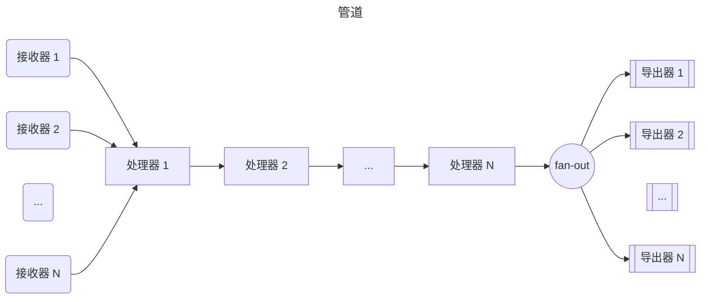
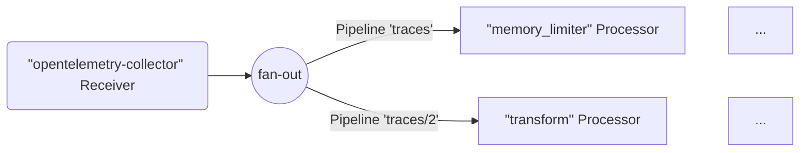
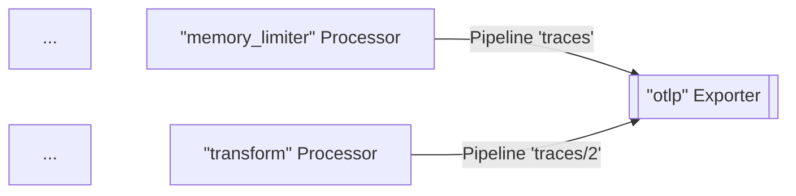
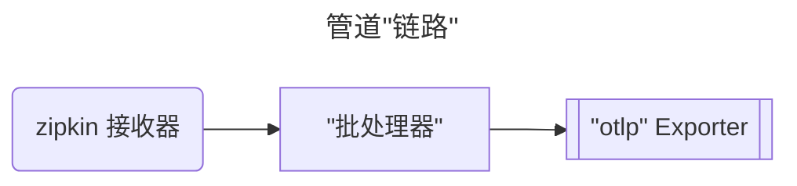
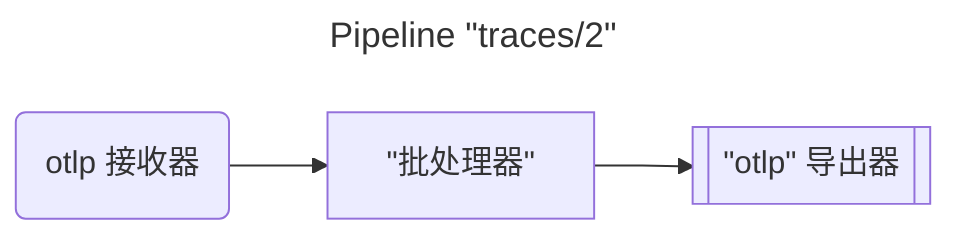
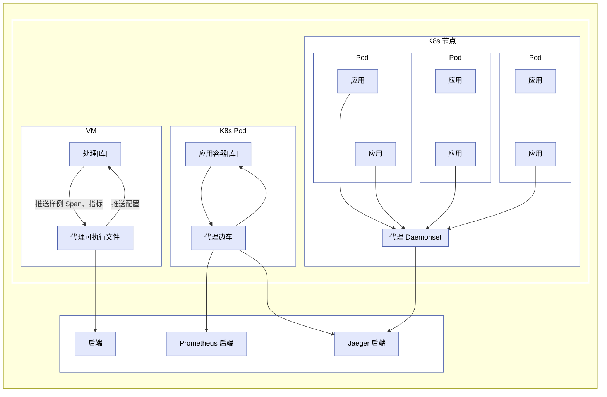
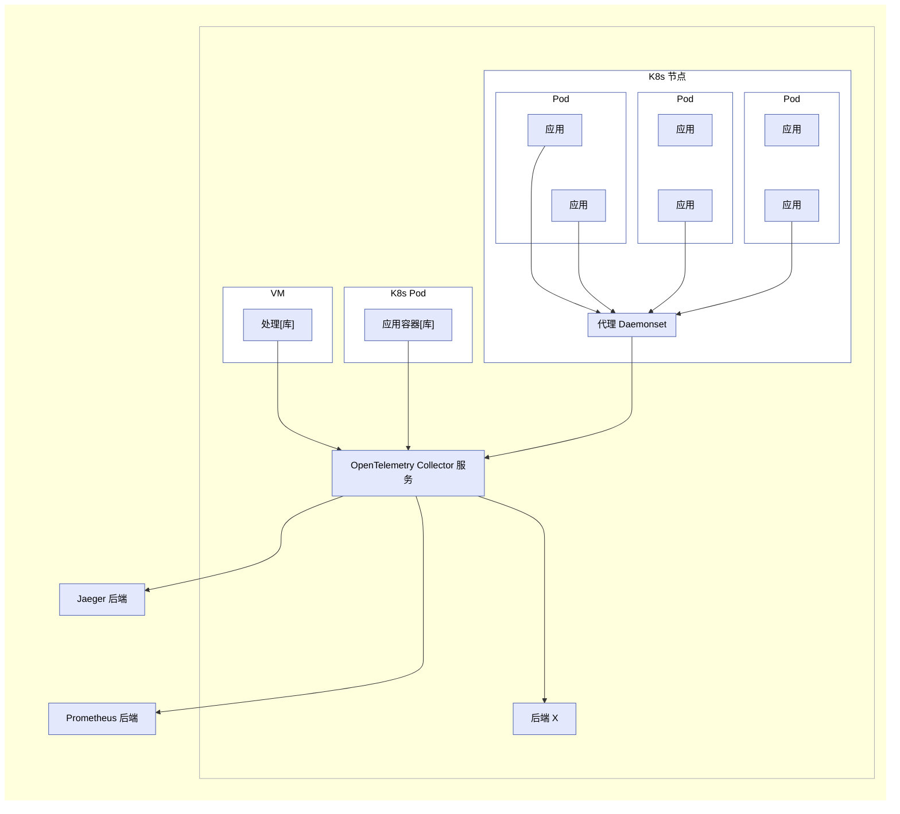

OpenTelemetry Collector 是一个可执行文件，它可以接收遥测数据、处理这些数据，并将其导出到多个目标，例如可观测性后端。

Collector 支持多种流行的开源协议用于接收和发送遥测数据，并提供可扩展的架构以支持更多协议的添加。

Data receiving, processing, and exporting are done using
[pipelines](#pipelines). 数据的接收、处理和导出通过[管道](#pipelines)完成。你可以将 Collector 配置为拥有一个或多个管道。

每个管道包括以下部分：

- 一组用于收集数据的[接收器](#receivers)
- 一系列可选的[处理器](#processors)，用于从接收器获取数据并进行处理
- 一组[导出器](#exporters)，用于从处理器获取数据并将其发送到 Collector 之外

同一个接收器可以被包含在多个管道中，多个管道也可以包含相同的导出器。

## 管道 {#pipelines}

管道定义了数据在 Collector 中的传递路径：从接收、处理（或修改）再到导出。

Pipelines can operate on three telemetry data types: traces, metrics, and logs.
The data type is a property of the pipeline defined by its configuration.
管道可以处理三种遥测数据类型：链路、指标和日志。数据类型是由其配置定义的管道属性。
用于管道的接收器、处理器和导出器必须支持该特定的数据类型，否则在加载配置时会报告
`pipeline.ErrSignalNotSupported` 异常。

下图表示了一个典型的管道：



Pipelines can have one or more receivers. Data from all receivers is pushed to
the first processor, which processes the data and then pushes it to the next
processor. A processor might also drop the data if it's sampling or filtering.
This continues until the last processor in the pipeline pushes the data to the
exporters. Each exporter gets a copy of each data element. The last processor
uses a `fanoutconsumer` to send the data to multiple exporters.

管道是在 Collector 启动时根据配置中定义的管道构建的。

一个典型的管道配置如下所示：

```yaml
service:
  pipelines: # 可包含多个子段，每个表示一个管道
    traces: # 管道类型
      receivers: [otlp, zipkin]
      processors: [memory_limiter, batch]
      exporters: [otlp, zipkin]
```

上述示例定义了一个 trace 类型的管道，包含两个接收器、两个处理器和两个导出器。

### 接收器 {#receivers}

Receivers typically listen on a network port and receive telemetry data. They
can also actively obtain data, like scrapers. Usually one receiver is configured
to send received data to one pipeline. However, it is also possible to configure
the same receiver to send the same received data to multiple pipelines. This can
be done by listing the same receiver in the `receivers` key of several
pipelines:

```yaml
receivers:
  otlp:
    protocols:
      grpc:
        endpoint: localhost:4317

service:
  pipelines:
    traces: # 一个 “traces” 类型的管道
      receivers: [otlp]
      processors: [memory_limiter, batch]
      exporters: [otlp]
    traces/2: # 另一个 “traces” 类型的管道
      receivers: [otlp]
      processors: [transform]
      exporters: [otlp]
```

在上述示例中，`otlp` 接收器会将相同的数据发送到 `traces` 管道和 `traces/2` 管道。

> 配置中使用复合键名的形式为 `type[/name]`。

当 Collector 加载这个配置后，结果如下图所示（部分处理器和导出器为简洁起见省略）：



{}

当同一个接收器在多个管道中被引用时，Collector 在运行时只创建一个接收器实例，
该实例将数据发送到一个 fan-out consumer。该 fan-out consumer 进一步将数据发送到每个管道的第一个处理器。
数据从接收器传递到 fan-out consumer，再传递到处理器，使用的是同步函数调用。
这意味着如果某个处理器阻塞了调用，与该接收器连接的其他管道也会被阻塞接收相同数据，
接收器本身也会停止处理并转发新接收到的数据。 The fan-out consumer in turn sends the data to the first processor of
each pipeline. The data propagation from receiver to the fan-out consumer and
then to processors is completed using a synchronous function call. This means
that if one processor blocks the call, the other pipelines attached to this
receiver are blocked from receiving the same data, and the receiver itself stops
processing and forwarding newly received data.

{}

### 导出器 {#exporters}

导出器通常将它们接收到的数据转发到网络上的某个目的地，但它们也可以将数据发送到其他地方。
例如，`debug` 导出器将遥测数据写入日志目标。 For example, `debug` exporter writes the
telemetry data to the logging destination.

The configuration allows for multiple exporters of the same type, even in the
same pipeline. 配置允许在同一个管道中包含多个相同类型的导出器。例如，可以定义两个 `otlp` 导出器，每个导出到不同的 OTLP 端点：

```yaml
exporters:
  otlp/1:
    endpoint: example.com:4317
  otlp/2:
    endpoint: localhost:14317
```

An exporter usually gets the data from one pipeline. 导出器通常从一个管道获取数据。但也可以配置多个管道将数据发送到同一个导出器：

```yaml
exporters:
  otlp:
    protocols:
      grpc:
        endpoint: localhost:14250

service:
  pipelines:
    traces: # 一个 “traces” 类型的管道
      receivers: [zipkin]
      processors: [memory_limiter]
      exporters: [otlp]
    traces/2: # 另一个 “traces” 类型的管道
      receivers: [otlp]
      processors: [transform]
      exporters: [otlp]
```

在上述示例中，`otlp` 导出器同时从 `traces` 和 `traces/2` 管道中获取数据。当
Collector 加载该配置后，结果如下图所示（为简洁起见省略部分处理器和接收器）： When the Collector loads this config, the result looks like
this diagram (part of processors and receivers are omitted for brevity):



### 处理器 {#processors}

A pipeline can contain sequentially connected processors. 一个管道可以包含多个按顺序连接的处理器。第一个处理器从该管道中配置的一个或多个接收器获取数据，
最后一个处理器将数据发送到该管道中配置的一个或多个导出器。
中间的所有处理器只从前一个处理器接收数据，并仅将数据发送给下一个处理器。 All processors between the first and last receive
the data from only one preceding processor and send data to only one succeeding
processor.

处理器可以在转发数据之前对其进行转换，例如添加或删除 Span 上的属性。
它们也可以决定不转发数据（例如，`probabilisticsampler` 处理器），从而丢弃数据或生成新数据。 They can also drop the data by deciding not to
forward it (for example, the `probabilisticsampler` processor). Or they can
generate new data.

The same name of the processor can be referenced in the `processors` key of
multiple pipelines. In this case, the same configuration is used for each of
these processors, but each pipeline always gets its own instance of the
processor. Each of these processors has its own state, and the processors are
never shared between pipelines. 在多个管道的 `processors` 键中可以引用相同名称的处理器。在这种情况下，
每个管道都会获得该处理器的一个独立实例，配置相同，但状态独立。
这些处理器不会在不同管道之间共享。例如，如果多个管道都使用了 `batch` 处理器，
那么每个管道都有自己的 `batch` 实例，配置是相同的，但实例是独立的。请参见以下配置： See the following configuration:

```yaml
processors:
  batch:
    send_batch_size: 10000
    timeout: 10s

service:
  pipelines:
    traces: # 一个 “traces” 类型的管道
      receivers: [zipkin]
      processors: [batch]
      exporters: [otlp]
    traces/2: # 另一个 “traces” 类型的管道
      receivers: [otlp]
      processors: [batch]
      exporters: [otlp]
```

当 Collector 加载该配置时，结果如下所示：





请注意，尽管这两个 `batch` 处理器使用相同的配置（`send_batch_size: 10000`），但它们是独立的实例。

> 同一个处理器名称不能在同一个管道的 `processors` 键中被多次引用。

## 以代理运行 {#running-as-an-agent}

On a typical VM/container, user applications are running in some processes/pods
with an OpenTelemetry library. Previously, the library did all the recording,
collecting, sampling, and aggregation of traces, metrics, and logs, and then
either exported the data to other persistent storage backends through the
library exporters, or displayed it on local zpages. This pattern has several
drawbacks, for example:

1. 每种 OpenTelemetry 库都必须用其对应的语言重新实现导出器和 zpages；
2. 某些编程语言（例如 Ruby 或 PHP）中，在进程内进行统计聚合较为困难；
3. 若想启用 OpenTelemetry 的 Span、统计或指标导出，应用用户需要手动添加库导出器并重新部署可执行程序。
   这在发生事故后希望立即借助 OpenTelemetry 进行排查时尤为困难；
   This is especially difficult when an incident has occurred, and users want to
   use OpenTelemetry to investigate the issue right away.
4. Application users need to take the responsibility for configuring and
   initializing exporters. These tasks are error-prone (for example, setting up
   incorrect credentials or monitored resources), and users may be reluctant to
   “pollute” their code with OpenTelemetry.

To resolve the issues above, you can run OpenTelemetry Collector as an agent.
The agent runs as a daemon in the VM/container and can be deployed independent
of the library. Once the agent is deployed and running, it should be able to
retrieve traces, metrics, and logs from the library, and export them to other
backends. We may also give the agent the ability to push configurations (such as
sampling probability) to the library. For those languages that cannot do stats
aggregation in process, they can send raw measurements and have the agent do the
aggregation.



> 对其他库的开发者和维护者：你可以通过添加特定的接收器，配置代理以接受来自其他追踪/监控库的数据，如
> Zipkin、Prometheus 等。详见[接收器](#receivers)。 See
> [Receivers](#receivers) for details.

## 以网关运行 {#running-as-a-gateway}

OpenTelemetry Collector 还可以作为网关实例运行，接收来自一个或多个代理、库或其他任务/代理所导出的
Span 和指标，只要它们使用 Collector 支持的协议之一。Collector 会根据配置将数据发送到指定的导出器。
以下图示总结了这种部署架构： The Collector is configured to send data to
the configured exporter(s). The following figure summarizes the deployment
architecture:



OpenTelemetry Collector 也可以用其他配置进行部署，例如从其他代理或客户端以接收器支持的某种格式来接收数据。
