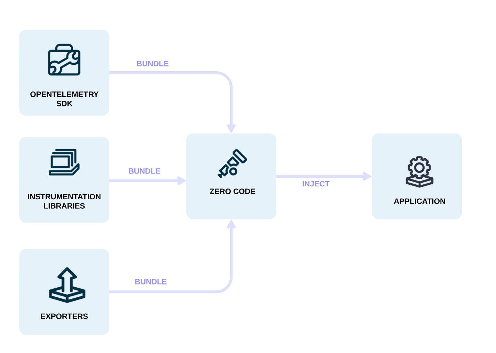

As [ops](/docs/getting-started/ops/) you might want to add observability to one
or more applications without having to edit the source. 作为一名[运维人员](/docs/getting-started/ops/)，你可能希望在不编辑源代码的情况下为一个或多个应用添加可观测性。
OpenTelemetry 允许你快速为某个服务增加一定程度的可观测性，而无需使用 OpenTelemetry API 和
SDK 进行[基于代码的插桩](/docs/concepts/instrumentation/code-based)。

零代码插桩通常以代理或类似代理的安装方式，将 OpenTelemetry API 和 SDK 的能力添加到你的应用中。
所涉及的具体机制可能因语言而异，包括字节码操作、猴子补丁或 eBPF，用于将对
OpenTelemetry API 和 SDK 的调用注入你的应用中。 The specific
mechanisms involved may differ by language, ranging from bytecode manipulation,
monkey patching, or eBPF to inject calls to the OpenTelemetry API and SDK into
your application.

Typically, zero-code instrumentation adds instrumentation for the libraries
you're using. This means that requests and responses, database calls, message
queue calls, and so forth are what are instrumented. Your application's code,
however, is not typically instrumented. To instrument your code, you'll need to
use [code-based instrumentation](/docs/concepts/instrumentation/code-based).

此外，零代码插桩允许你配置加载的[插桩库](/docs/concepts/instrumentation/libraries)和[导出器](/docs/concepts/components/#exporters)。

You can configure zero-code instrumentation through environment variables and
other language-specific mechanisms, such as system properties or arguments
passed to initialization methods. To get started, you only need a service name
configured so that you can identify the service in the observability backend of
your choice.

还有其他可用的配置选项，包括：

- 特定数据源的配置
- 导出器配置
- 传播器配置
- 资源配置

以下语言提供了自动插桩功能：

- [.NET](/docs/zero-code/dotnet/)
- [Go](/docs/zero-code/go)
- [Java](/docs/zero-code/java/)
- [JavaScript](/docs/zero-code/js/)
- [PHP](/docs/zero-code/php/)
- [Python](/docs/zero-code/python/)
