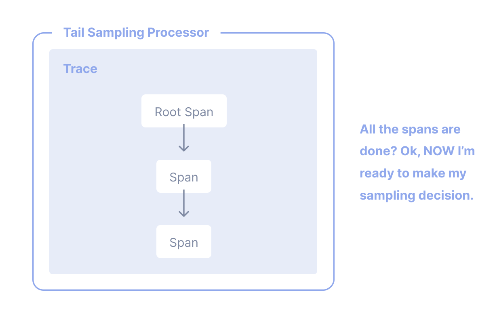

通过[链路](/docs/concepts/signals/traces)，你可以观测请求在分布式系统中从一个服务传递到另一个服务的过程。
链路追踪对于系统的高层次分析和深入分析都非常实用。 Tracing is highly
practical for both high-level and in-depth analysis of systems.

然而，如果你的大多数请求都是成功的，并且在可接受的延迟范围内完成且没有错误，那么你无需收集
100% 的链路数据也能有意义地观测你的应用和系统。你只需要正确的采样即可。 You just need the right
sampling.

## 术语 {#terminology}

It's important to use consistent terminology when discussing sampling. A trace
or span is considered "sampled" or "not sampled":

- **Sampled**: A trace or span is processed and exported. Because it is chosen
  by the sampler as a representative of the population, it is considered
  "sampled".
- **未采样**：一个链路或 Span 未被处理或导出。由于它未被采样器选中，因此被认为是“未采样”的。 Because it is
  not chosen by the sampler, it is considered "not sampled".

Sometimes, the definitions of these terms get mixed up. 有时，这些术语的定义会被混淆。你可能会发现有人说他们在“采样出数据”或认为未被处理或导出的数据被认为是“已采样”的。
这些说法是不正确的。 These are incorrect statements.

## 为什么要采样？ {#why-sampling}

采样是降低可观测性成本而不失去可见性的最有效方法之一。虽然还有其他降低成本的方法，
如过滤或聚合数据，但这些方法不符合代表性概念，而代表性在对应用或系统行为进行深入分析时至关重要。 Although there are other ways to lower costs, such as
filtering or aggregating data, these other methods do not adhere to the concept
of representativeness, which is crucial when performing in-depth analysis of
application or system behavior.

代表性是一个原则，指的是一个较小的群体可以准确地代表一个较大的群体。此外，
代表性是可以通过数学方式验证的，这意味着你可以高度确信一个较小的数据样本能够准确地代表较大的群体。 Additionally, representativeness can be mathematically
verified, meaning that you can have high confidence that a smaller sample of
data accurately represents the larger group.

Additionally, the more data you generate, the less data you actually need to
have a representative sample. 此外，产生的数据越多，你实际所需的代表性样本数据就越少。对于高吞吐量系统，
1% 或更低的采样率通常就能非常准确地代表其余 99% 的数据。

### 何时进行采样 {#when-to-sample}

如果你满足以下任一条件，请考虑进行采样：

- 你每秒生成 1000 个或更多链路。
- 你的大多数链路数据代表的是健康流量，数据变化很小。
- 你有一些通用的标准，如错误或高延迟，通常意味着系统出现问题。
- 你拥有一些特定领域的标准，可以用来判断除错误和延迟之外的相关数据。
- 你可以描述一些通用规则来决定哪些数据应被采样或丢弃。
- 你可以区分服务，以便对高吞吐量服务和低吞吐量服务进行不同的采样。
- 你有方法将未采样的数据（用于“以防万一”的场景）路由到低成本的存储系统中。

最后，请考虑你的整体预算。如果你的可观测性预算有限，但可以投入时间来进行有效的采样，那么采样通常是值得的。 If you have limited budget for
observability, but can afford to spend time to effectively sample, then sampling
can generally be worth it.

### 何时不进行采样 {#when-not-to-sample}

Sampling might not be appropriate for you. 采样可能并不适合你。如果你满足以下任一条件，你可能想避免采样：

- 你生成的数据非常少（每秒几十个小型链路或更少）。
- 你仅以聚合形式使用可观测性数据，因此可以预先对数据进行聚合。
- 你受制于法律或合规规定而无法丢弃数据（且无法将未采样数据路由到低成本存储中）。

最后，请考虑与采样相关的以下三种成本：

1. 有效采样数据所需的计算成本，例如尾部采样代理。
2. 随着更多应用、系统和数据的加入，维护有效采样方法的工程间接成本。
3. 使用无效采样技术而错过关键信息的机会成本。

Sampling, while effective at reducing observability costs, might introduce other
unexpected costs if not performed well. 采样虽然能有效降低可观测性成本，但如果操作不当，也可能引入其他意想不到的成本。
根据你的可观测性后端、数据性质以及采样尝试的有效性，分配更多资源用于可观测性
（无论是使用供应商服务还是自托管计算资源）可能反而更便宜。

## 头部采样 {#head-sampling}

Head sampling is a sampling technique used to make a sampling decision as early
as possible. A decision to sample or drop a span or trace is not made by
inspecting the trace as a whole.

例如，最常见的一种头部采样形式是[一致概率采样](/docs/specs/otel/trace/tracestate-probability-sampling-experimental/#consistent-probability-sampling)。
这也被称为确定性采样。在这种情况下，采样决策基于链路 ID 和希望采样的链路百分比。
这确保了整个链路被采样（不会漏掉任何 Span）并以一致的速率进行采样，例如采样所有链路的 5%。
This is also be referred to as Deterministic Sampling. In this case, a sampling
decision is made based on the trace ID and the desired percentage of traces to
sample. This ensures that whole traces are sampled - no missing spans - at a
consistent rate, such as 5% of all traces.

The upsides to head sampling are:

- 易于理解
- 易于配置
- 高效
- 可以在链路收集管道中的任意点进行

The primary downside to head sampling is that it is not possible to make a
sampling decision based on data in the entire trace. For example, you cannot
ensure that all traces with an error within them are sampled with head sampling
alone. For this situation and many others, you need tail sampling.

## 尾部采样 {#tail-sampling}

Tail sampling is where the decision to sample a trace takes place by considering
all or most of the spans within the trace. Tail Sampling gives you the option to
sample your traces based on specific criteria derived from different parts of a
trace, which isn’t an option with Head Sampling.

你可以使用尾部采样执行以下操作：

- 始终采样包含错误的链路
- 基于整体延迟采样链路
- 基于一个或多个 Span 中特定属性的存在或属性值采样链路；例如，采样更多来自新部署服务的链路
- 根据某些条件对链路应用不同的采样率，例如分别处理来自低吞吐量服务与高吞吐量服务的链路

As you can see, tail sampling allows for a much higher degree of sophistication
in how you sample data. For larger systems that must sample telemetry, it is
almost always necessary to use Tail Sampling to balance data volume with the
usefulness of that data.

目前，尾部采样有以下三个主要缺点：

1. Tail sampling can be difficult to implement. Depending on the kind of
   sampling techniques available to you, it is not always a "set and forget"
   kind of thing. As your systems change, so too will your sampling strategies.
   For a large and sophisticated distributed system, rules that implement
   sampling strategies can also be large and sophisticated.
2. Tail sampling can be difficult to operate. The component(s) that implement
   tail sampling must be stateful systems that can accept and store a large
   amount of data. Depending on traffic patterns, this can require dozens or
   even hundreds of compute nodes that all utilize resources differently.
   Furthermore, a tail sampler might need to "fall back" to less computationally
   intensive sampling techniques if it is unable to keep up with the volume of
   data it is receiving. Because of these factors, it is critical to monitor
   tail-sampling components to ensure that they have the resources they need to
   make the correct sampling decisions.
3. Tail samplers often end up as vendor-specific technology today. If you're
   using a paid vendor for Observability, the most effective tail sampling
   options available to you might be limited to what the vendor offers.

Finally, for some systems, tail sampling might be used in conjunction with Head
Sampling. 最后，对于某些系统，尾部采样可能与头部采样结合使用。例如，
一组产生极高链路数据量的服务可能首先使用头部采样来采样一小部分链路，
然后在遥测管道的后续阶段使用尾部采样在导出到后端前做出更复杂的采样决策。
这通常是为了保护遥测管道不被超负荷使用。 This is often
done in the interest of protecting the telemetry pipeline from being overloaded.

## 支持 {#support}

### Collector

OpenTelemetry Collector 包含以下采样处理器：

- [概率采样处理器](https://github.com/open-telemetry/opentelemetry-collector-contrib/tree/main/processor/probabilisticsamplerprocessor)
- [尾部采样处理器](https://github.com/open-telemetry/opentelemetry-collector-contrib/tree/main/processor/tailsamplingprocessor)

### 语言 SDK {#language-sdks}

有关 OpenTelemetry API & SDK 各语言实现的采样支持，请参见各自的文档页面：

{}

### 供应商 {#vendors}

Many [vendors](/ecosystem/vendors) offer comprehensive sampling solutions that
incorporate head sampling, tail sampling, and other features that can support
sophisticated sampling needs. These solutions may also be optimized specifically
for the vendor's backend. If you are sending telemetry to a vendor, consider
using their sampling solutions.
